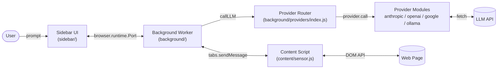

# Architecture

Firefox LLM Bridge is a Manifest V3 extension structured in three layers.

## High-Level Layout



## Layers

### Sensor — `content/sensor.js`

Content script injected into every page. Two responsibilities:

1. **Sensor**: Walk the DOM and emit a semantic accessibility map. Every interactive element receives an entry with `role`, `label`, `selector`, `bounds`, and role-specific attributes (`checked`, `value`, `href`, `expanded`).
2. **Actor**: Execute click, type, scroll, and text-extraction actions dispatched from the background worker.

The sensor is provider-agnostic. It does not import or know anything about LLMs.

**Role inference order**: explicit ARIA role → tag name → input `type` → `tabindex` / `onclick` / `data-action` → `contentEditable`.

**Label priority**: `aria-label` → `aria-labelledby` → associated `<label for>` → text content → input `value` → `placeholder` → `title` → child `img[alt]`.

**Selector generation**: id → `data-testid` / `data-test` / `data-cy` / `data-action` → tag.class[:nth-of-type] chain bubbling up to an ancestor with an id.

### Brain — `background/background.js` + `background/providers/`

Background service worker module. Receives messages from the sidebar port, runs the agent loop, dispatches actions to the content script, and routes LLM calls through the provider abstraction.

**Agent loop**:

```
loop while turn < maxTurns and not aborted:
    response = callLLM(systemPrompt, history, tools, signal)
    history.push(assistant: response.content)
    for each content block:
        if text: notify sidebar
        if tool_use: execute tool, append result to history
    if stop_reason == "end_turn" or task_complete called: break
```

**Provider abstraction** (`background/providers/index.js`):

Exports a single `callLLM(systemPrompt, messages, tools, signal)` entry point. Each provider module implements:

```
{
  id, name, requiresKey, models,
  validateKey(key),
  formatTools(tools),         // → provider-native tool format
  formatMessages(messages),   // → provider-native message format
  call(apiKey, model, systemPrompt, messages, tools, signal),
  buildToolResultMessage(toolResults)
}
```

The internal canonical message format is Anthropic-shaped (richest schema). Other providers convert in/out.

### UI — `sidebar/` + `options/`

- **Sidebar**: chat and agent interaction. Connects to the background via a long-lived port (`browser.runtime.connect({ name: "topologica-sidebar" })`). Re-connects automatically on disconnect.
- **Options**: provider configuration, API-key entry, connection testing, Ollama model auto-detection.

## Message Flow Example: Agent Mode "summarize this page"

1. User types prompt and clicks Send.
2. Sidebar sends `{ type: "SEND_MESSAGE", text }` to background.
3. Background pushes message to `state.conversationHistory` and calls `runAgentLoop`.
4. `runAgentLoop` invokes `callLLM` with the unified tool definitions.
5. Provider router loads the active provider config from `browser.storage.local` and dispatches `provider.call(...)`.
6. Provider module makes a `fetch` to the API, returns normalized response.
7. If `stop_reason === "tool_use"`, background sends `{ type: "SENSOR_READ" }` to the content script, gets the accessibility map, packages it as a `tool_result` message, loops back to step 4.
8. When the model emits `task_complete`, the loop exits, and the sidebar receives `TASK_COMPLETE`.

## Trust Boundaries

| Boundary | Trust |
|----------|-------|
| User ↔ Extension | User authorizes via Firefox install + AMO review |
| Extension ↔ Page DOM | Page is untrusted. Content script reads but does not eval. |
| Extension ↔ Provider API | User-chosen. User's API key authorizes the request. |
| Extension ↔ Ollama (localhost) | Same-origin guarded by CORS + `OLLAMA_ORIGINS` |
| Extension ↔ Other extensions | None — no `externally_connectable` |

See [THREAT_MODEL.md](THREAT_MODEL.md) for the full threat enumeration.

## Hard Constraints (do not break)

- No bundlers, transpilers, or build steps for shipped code
- No runtime dependencies, no CDN imports
- No minification or obfuscation
- `browser.*` namespace only — never `chrome.*`
- API keys stored only in `browser.storage.local`
- The content script must remain provider-agnostic
- The tool definitions in `background/background.js` must remain provider-agnostic
